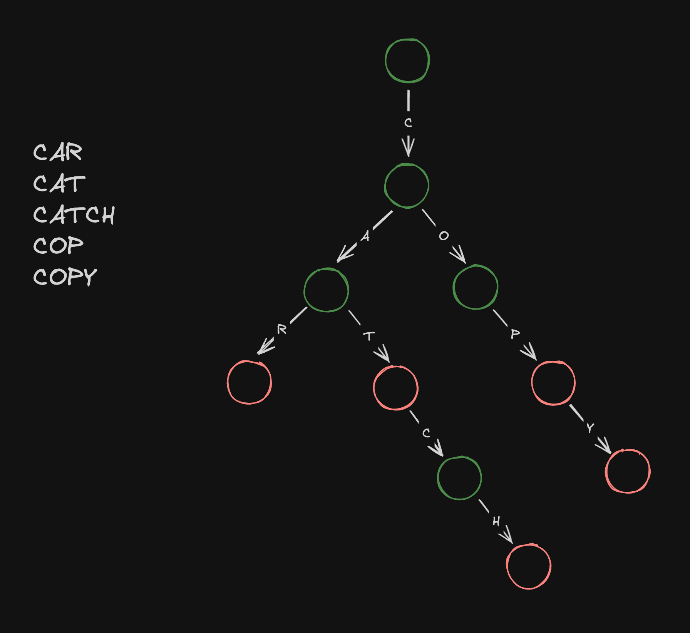

문자열을 저정하고 검색하는데 최적화된 자료구조인 트라이(Trie)에 대해서 알아보겠습니다.

## Trie

접두사 트리(Prefix tree)라고도 불리는 트라이는 일종의 [트리(Tree)](/data-structures/binary-tree/)로써 많은 문자열을 저장하고 검색해야할 때 매우 효과적인 자료구조입니다.
대표적인 응용 사례로 자동 완성과 맞춤법 검사기를 들 수 있는데, 이러한 애플리케이션을 개발할 때는 대안이 없을 정도로 좋은 성능을 발휘합니다.

트라이에서 각 노드에는 글자를 나타내며, 최상위 노드부터 아래로 내려오면서 단어를 추가하거나 검색할 수 있습니다.
예를 들어, `CAR`, `CAT`, `CATCH`, `COP`, `COPY`가 저장된 트라이는 다음과 같은 모습이 됩니다.
모든 단어에는 총 18개의 글자가 있지만 공통 되는 글자가 많아서 단 10개의 글자만 저장해도 충분한 것을 볼 수 잇습니다.



여기서 초록색 노드는 끝나는 단어가 없는 글자, 빨간색 노드는 끝나는 단어가 있는 글자를 나타냅니다.
이렇게 각 글자에서 끝나는 단어가 있는지 없는지를 표시해놓으면 어떤 문자열로 시작하는 단어가 트라이에 저장되어 있는지 뿐만 아니라 정확히 전체 단어가 저장되어 있는지도 알아낼 수 있습니다.

예를 들어, 위 트라이를 통해서 우리는 `CAT`과 `CATCH`는 저장이 되어 있지만, `CA`와 `CATC`는 저장되어 않다는 것을 알 수 있습니다.

## Trie 노드

트라이 노드는 해당 글자의 다음 글자가 될 수 있는 글자들과 해당 글자에서 끝나는 단어가 있는지 여부를 저장해야하는데요.
그래서 다음과 같이 클래스의 형태로 많이 표현을 합니다.

```py
class Node:
    def __init__(self, ending=False):
        self.children = {}
        self.ending = ending
```

이진 트리처럼 자식의 노드의 수가 정해져 있기 때문에 고정된 수의 인스턴스 변수를 사용하는 대신에 [해시 테이블(Hash Table)](/data-structures/hash-table/)을 사용합니다.
키로 다음 글자를 저장해두면 다음 글자를 나타내는 노드를 상수 시간에 접근하거나 추가할 수 있기 때문입니다.

클래스를 선언하기 귀찮은 경우에눈 해시 테이블 자체를 트라이의 노드로 사용하는 것도 가능합니다.
이 때는 글자로 사용될 수 없는 임의의 특수 문자로 키로 해당 글자에서 끝나는 단어가 있는지 여부를 저장하면 됩니다.

예를 들어, 위의 트라이 전체를 파이썬의 사전으로 표현해보면 다음과 같은 구조가 될 것입니다.

```py
{
  "$": False,
  "C": {
    "$": False
    "A": {
      "$": False,
      "R": {
        "$": True
      },
      "T": {
        "$": True,
        "C": {
          "$": False,
          "H": {
            "$": True
          }
        }
      }
    },
    "O": {
      "$": False,
      "P": {
        "$": True,
        "Y": {
          "$": True,
        }
      }
    }
  }
}
```

트라이 노드는 [해시 테이블(Hash Table)](/data-structures/hash-table/)을 통해서

## 단어 추가

새로운 단어를 트라이에 저장할 때는 단어를 상대로 루프를 돌면서 트라이에 없는 글자가 나오는 경우에만 새로운 노드를 삽입하면 됩니다.
그리고 마지막에는 글자에서는 반드시 단어가 끝난다고 표시를 해줍니다.

```py
class Trie:
    def __init__(self):
        self.root = Node(ending=True)

    def insert(self, word: str) -> None:
        node = self.root
        for ch in word:
            if ch not in node.children:
                node.children[ch] = Node()
            node = node.children[ch]
        node.ending = True
```

트라이도 트리 자료구조이므로 재귀 알고리즘으로도 구현할 수 있습니다.

```py
class Trie:
    def __init__(self):
        self.root = Node(ending=True)

    def insert(self, word: str) -> None:
        def dfs(node, idx):
            if idx == len(word):
                node.ending = True
                return
            ch = word[idx]
            if ch not in node.children:
                node.children[ch] = Node()
            dfs(node.children[ch], idx + 1)

        dfs(self.root, 0)
```

## 단어 검색

트라이 자료구조를 사용하면 특정 문자열로 시작하는 단어도 찾을 수 있고, 특정 문자열 전체와 일치하는 단어를 찾을 수도 있습니다.

두 가지 경우 모두 주어진 단어를 상대로 루프를 돌다가 트라이에 없는 글자가 나오는 경우 바로 거짓을 반환합니다.
차이점은 모든 글자가 트라이에 있어서 루프가 종료되었을 때인데요.
문자열로 시작하는 단어도 찾는 경우에는 바로 참을 반환할 수 있지만, 전체 단어를 검색하는 경우라면 해당 글자에서 단어가 끝나는지 여부까지 확인을 해줘야 합니다.

```py
class Trie:
    def search(self, word: str) -> bool:
        node = self.root
        for ch in word:
            if ch not in node.children:
                return False
            node = node.children[ch]
        return node.ending

    def startsWith(self, prefix: str) -> bool:
        node = self.root
        for ch in prefix:
            if ch not in node.children:
                return False
            node = node.children[ch]
        return True
```

재귀 알고리즘으로도 구현해보았습니다.

```py
class Trie:
    def search(self, word: str) -> bool:
        def dfs(node, idx):
            if idx == len(word):
                return node.ending
            ch = word[idx]
            if ch not in node.children:
                return False
            return dfs(node.children[ch], idx + 1)

        return dfs(self.root, 0)

    def startsWith(self, prefix: str) -> bool:
        def dfs(node, idx):
            if idx == len(prefix):
                return True
            ch = prefix[idx]
            if ch not in node.children:
                return False
            return dfs(node.children[ch], idx + 1)

        return dfs(self.root, 0)
```
